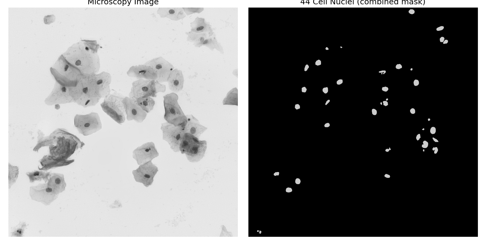
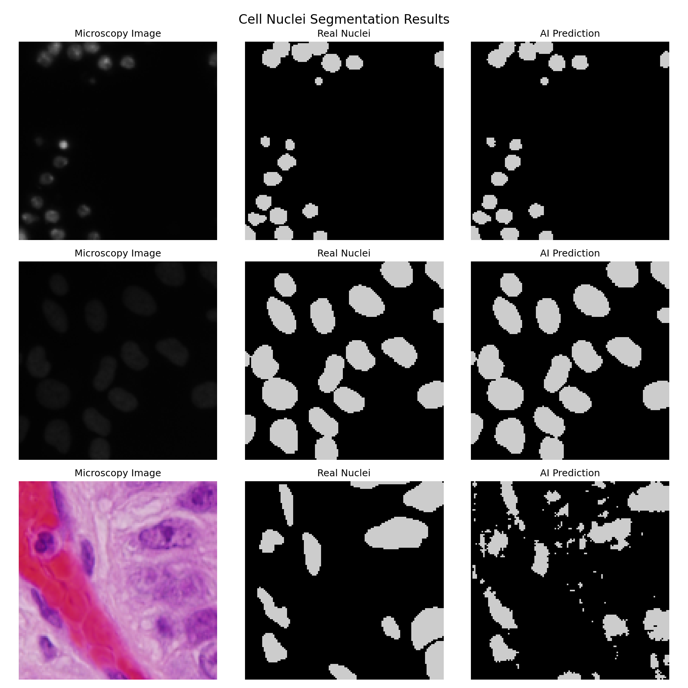
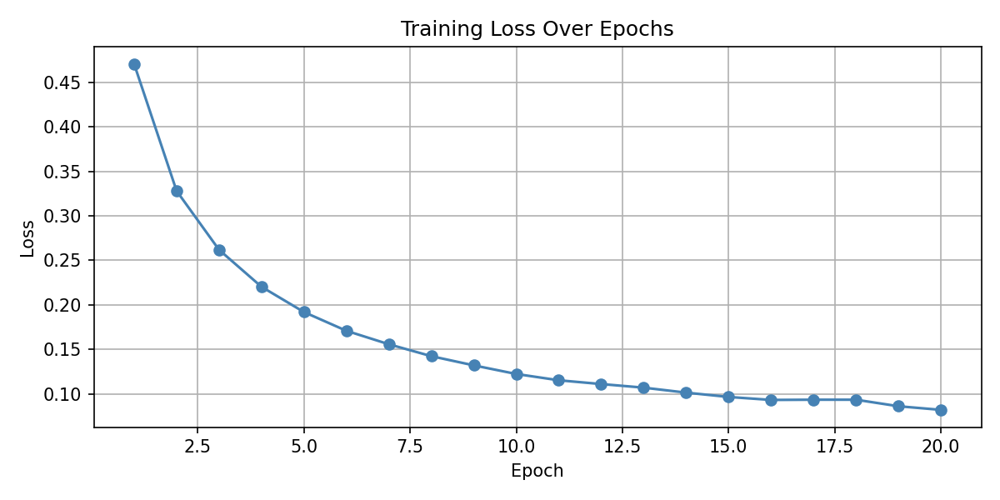

# 🔬 Cell Nuclei Segmentation from Microscopy Images

Automatically detecting and segmenting cell nuclei in microscopy images 
using a U-Net trained on real biological imaging data.

## What this project does
Takes a microscopy image and identifies every individual cell nucleus —
a task directly relevant to biomedical image analysis and my thesis work
on neurite morphology.

## Dataset
669 real microscopy images with pixel-level nucleus annotations, 
sourced from the Data Science Bowl 2018 nuclei segmentation challenge.

## Model
2D U-Net built with MONAI.
- Training images: 568
- Test images: 101
- Epochs: 20
- Final loss: 0.0821
- **Average Dice Score: 0.8995**

## Results
| | |
|---|---|
| Sample image + combined mask | AI predictions vs real nuclei | **Average Dice Score: 0.8995**
|  |  |

## Loss Curve

## Limitations & Next Steps
- Trained on a single dataset — generalization to other cell types is untested
- Next: apply this pipeline to neurite morphology analysis
- Next: try instance segmentation to separate touching nuclei individually

## How to run
Open the notebook in Google Colab:
1. Upload your kaggle.json
2. Run all cells in order

## Tools used
Python · PyTorch · MONAI · NumPy · Matplotlib
